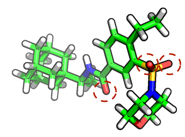

[[back to overview](../../README.md)]

# MOL2 functional group filter

The `mol2_filter_funcgroups.py` filters for MOL2 structures in a multi-MOL2 file that contain certain functional groups specified by an atom name an a charge range.

For more info about the particular SYBYL atom types that are used in the MOL2 file format, please see [http://www.tripos.com/mol2/atom_types.html](http://www.tripos.com/mol2/atom_types.html).

### Usage

run `./mol2_filter_funcgroups.py --help` for the usage information:

<pre>
usage: mol2_filter_funcgroups.py [-h] [-i INPUT] [-o OUTPUT] [-c CRITERIA]
                                 [-m]

Filter for MOL2 molecules that contain certain functional groups. 
By default, all molecules that match at least 1 criterion are returned, and if 
--matchall flag is provided, all criteria must be satified.

optional arguments:
  -h, --help            show this help message and exit
  -i INPUT, --input INPUT
                        MOL2 input file.
  -o OUTPUT, --output OUTPUT
                        MOL2 output file for filtered results.
  -c CRITERIA, --criteria CRITERIA
                        Query atom and charge ranges e.g., "O.2,-1.2,2;O.3,-20.0,100.0".
  -m, --matchall        If flag is provided, molecule must satisfy all criteria.

Example:
./mol2_filter_funcgroups.py -i ./my.mol2 -c "O.2,-1.2,2;O.3,-20.0,100.0" -o ./filtered.mol2
</pre>

 
 

### Example 1 - Negatively charged sp2 hybridized oxygen

The criteria provided by the `--critiria` flag are provided as a semicolon-separated string where the each semicolon-separated entry consists of a atom type name and to values for the charge range. E.g.,

"O.2,-2.0,-0.1" means: Filter for atom type "O.2" (oxygen sp2) in the charge range >= -2.0 and <= -0.1.

Input: A file that contains multiple MOL2 structures.

	./mol2_filter_funcgroups.py -i ../../tests/examples/ex1.mol2 "O.2,-2.0,-0.1" -o ~/Desktop/neg_oxy.mol2

**Screen Output**: Names of the molecules that match the criteria. Here:

<pre>
MOLECULE1
MOLECULE2
MOLECULE3
MOLECULE4
MOLECULE5
</pre>

**File Output** : A multi-MOL2 file with the structures that match the criterion.

 
 

### Example 2 - Negatively charged sp2 hybridized oxygen OR sulfone sulfur

The criteria provided by the `--critiria` flag are provided as a semicolon-separated string where the each semicolon-separated entry consists of a atom type name and to values for the charge range. E.g.,

"O.2,-2.0,-0.1;S.o2,0.1,2.9" means: Filter for atom type "O.2" (oxygen sp2) in the charge range >= -2.0 and <= -0.1 **OR** atom type "S.o2" (sulfone sulfur) in the charge range >= 0.1 and <= 2.9.

Input: A file that contains multiple MOL2 structures.

	./mol2_filter_funcgroups.py -i ../../tests/examples/ex1.mol2 "O.2,-2.0,-0.1;S.o2,0.1,2.9" -o ~/Desktop/neg_oxy.mol2

**Screen Output**: Names of the molecules that match the criteria. Here:

<pre>
MOLECULE1
MOLECULE2
MOLECULE3
MOLECULE4
MOLECULE5
</pre>

**File Output** : A multi-MOL2 file with the structures that match the criterion.

 
 

### Example 3 - Negatively charged sp2 hybridized oxygen AND sulfone sulfur

The criteria provided by the `--critiria` flag are provided as a semicolon-separated string where the each semicolon-separated entry consists of a atom type name and to values for the charge range. E.g.,

"O.2,-2.0,-0.1;S.o2,0.1,2.9" means: Filter for atom type "O.2" (oxygen sp2) in the charge range >= -2.0 and <= -0.1 **AND** atom type "S.o2" (sulfone sulfur) in the charge range >= 0.1 and <= 2.9.

Input: A file that contains multiple MOL2 structures.

	./mol2_filter_funcgroups.py -i ../../tests/examples/ex1.mol2 "O.2,-2.0,-0.1;S.o2,0.1,2.9" -o ~/Desktop/neg_oxy.mol2 --matchall

**Screen Output**: Names of the molecules that match the criteria. Here:

<pre>
MOLECULE1
</pre>

**File Output** : A multi-MOL2 file with the structures that match the criterion.

