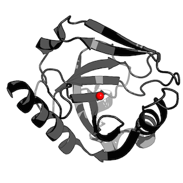

[[back to overview](../../README.md)]

# Center of Mass

Calculates the center of mass for a protein and/or ligand structure in a PDB file weighted by atom types. By default, all atoms with valid ATOM and HETATM entries in the PDB file's coordinate section are included in the center of mass calculation.

### Usage

Run `./pdb_center_of_mass.py --help` for usage information:

<pre>
usage: pdb_center_of_mass.py [-h] [-i INPUT] [-p] [-l]

Calculates the weighted center of mass for structures in a PDB file.
By default, all atoms in the PDB file are included in the calculation.

optional arguments:
  -h, --help            show this help message and exit
  -i INPUT, --input INPUT
                        Input PDB file.
  -p, --protein         Center of mass for atoms in ATOM sections only
  -l, --ligand          Center of mass for atoms in HETATM sections only

Example:
pdb_center_of_mass.py ~/Desktop/3EIY.pdb -p
[8.979, 41.661, 12.495]

Note that for the center of mass calculation, the relative
atomic weights are taken into account (atomic mass unit [u]).

A list of the atomic weights can be found, e.g., at
http://en.wikipedia.org/wiki/List_of_elements
</pre>

 
 

### Example

**Input:**

	./pdb_center_of_mass.py -i ./tests/data/pdbs/3EIY.pdb -p

**Screen Output:**

	[8.979, 41.661, 12.495]

**Visualization in PyMOL:**

(**Tip**: you can can create a pseudo-atom at a given coordinate in PyMol via  
`pseudoatom masscenter, b=40, color=red, pos=[8.979, 41.661, 12.495]`)
