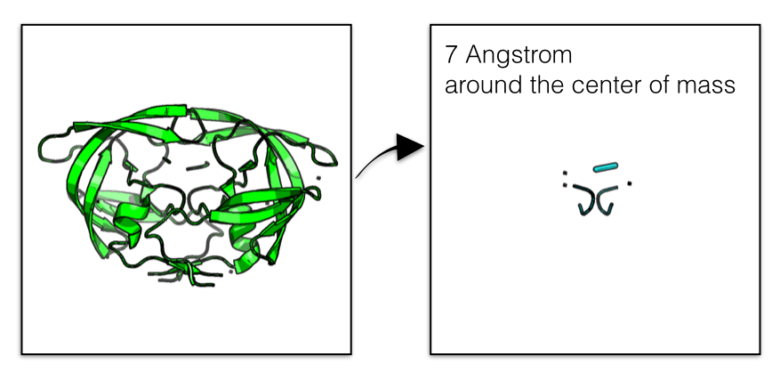

[[back to overview](../../README.md)]

# Grab atoms within a radius

The `pdb_grab_atom_radius.py` script extracts atoms within a radius from a coordinate center.

### Usage

Run `./pdb_grab_atom_radius.py --help` for usage information:

<pre>
usage: pdb_grab_atom_radius.py [-h] [-i INPUT] [-r int/float] [-c X,Y,Z]
                               [-n coordinate-ID] [-o out.fasta]

Extracts atoms within a radius from a PDB file.
By default, all atoms in the PDB file are included in the calculation.

optional arguments:
  -h, --help            show this help message and exit
  -i INPUT, --input INPUT
                        Input PDB file
  -r int/float, --radius int/float
                        radius in Angstrom for atoms to extract (default 10.0)
  -c X,Y,Z, --coordinates X,Y,Z
                        center for extracting atoms (default "0,0,0")
  -n coordinate-ID, --include coordinate-ID
                        Coordinate lines to include (default: "ATOM,HETATM")
  -o out.fasta, --out out.fasta
                        writes atoms to an output file instead of printing it to the screen
</pre>

 
 

### Example

**Input:** `./pdb_grab_atom_radius.py -i3B7V.pdb -c 13.863,26.129,19.407 -r 7.0 -o 3B7V_rad7.pdb`

**File Output:**

